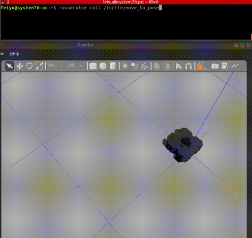
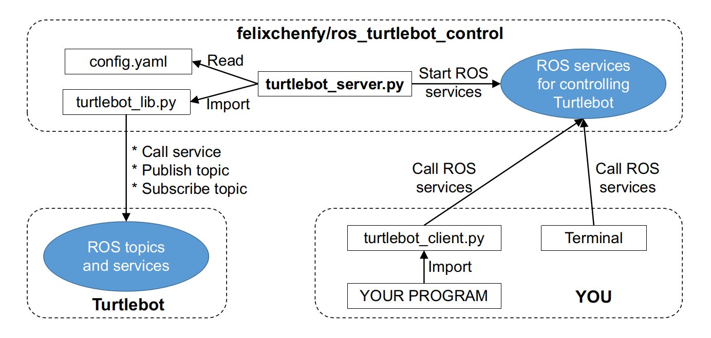

ROS Turtlebot Control
========================

**Demo:** Result of running these two commands:
```
rosservice call /turtle/move_to_pose -- -1 -1 -1.57 # (x, y, theta)
rosservice call /turtle/move_to_relative_point -- -1 1 # (x, y)
# Coordinate: +x is front, +y is left; +theta is x to y.
```



**Contents**:
- [Introduction](#introduction)
- [Example of usage](#example-of-usage)
  * [Installation](#installation)
  * [Check configuration](#check-configuration)
  * [Start services' server](#start-services--server)
  * [Call services from command line](#call-services-from-command-line)
  * [Call services from python functions](#call-services-from-python-functions)


# Introduction

**Main services**:
```
# Control robot to pose.
#   The control algorithm will run in a new thread, 
#   and the service call is immediately finished.
#   If a new command is sent, the old one stops immediatly.
MoveToPose.srv   
MoveToRelativePose.srv   
MoveToPoint.srv  
MoveToRelativePoint.srv

# Get/Set state.
GetPose.srv
StopMoving.srv
IsMoving.srv
ResetPose.srv
SetPose.srv # Only for simulation.
```

**Algorithm**:
The `Move to Pose` algorithm is adopted, which uses PID control to reduce the distance between robot pose (x, y, theta) and target pose (x*, y*, theta*). The code is implemented in [turtle_lib.py](turtle_lib.py) and `def _control_robot_to_pose`. 

**Reference**:
For more details about the algorithm, please see Professor Peter Corke's book `Robotics, Vision and Control`, Chapter 4.1.1.4--Moving to a Pose.

**Main files:**
* [turtle_lib.py](turtle_lib.py)
* [turtlebot_server.py](turtlebot_server.py)
* [turtlebot_client.py](turtlebot_client.py)
* [config.yaml](config.yaml)

**System diagram:**



# Example of usage

## Installation

Download my project:
```
cd ~/catkin_ws/src # Your catkin workspace
git clone https://github.com/felixchenfy/ros_turtlebot_control
```

Install Gazebo and Turtlebot related packages. See this: [doc/dependencies.md](doc/dependencies.md). Make sure the simulated Turtlebot can run in Gazebo.

## Check configuration

Open [config.yaml](config.yaml), check the section `ROS topics/services name used by this package`. Make sure the ROS topic/service/tf names are same as yours.

Especially these keywords:
* `model_name`: It should be one of the `turtlebot3_waffle_pi`, `turtlebot3_waffle`, `turtlebot3_burger`.
* `base_frame`: You can use `$ rosrun tf view_frames` to see the tf tree and know your `base_frame` name.

## Start services' server

Launch your real Turtlebot3. Or start a simulation like this:
```
roscore
roslaunch turtlebot3_gazebo turtlebot3_empty_world.launch 
``` 

Start this turtlebot control server:
``` 
rosrun ros_turtlebot_control turtlebot_server.py   
```

## Call services from command line

* Move to (x=-1, y=-1, theta=1.57):
```
rosservice call /turtle/move_to_pose -- -1 -1 1.57
```
(Notes: `--` is a ROS default argument. It's used when the arguments have negative value.)

* Move to (x=1, y=1):
```
rosservice call /turtle/move_to_point 1 1
```

* Move to relative (x=1, y=0, theta=1.57):
```
rosservice call /turtle/move_to_relative_pose 1 0 1.57
```

* Move to relative (x=0, y=-1):
```
rosservice call /turtle/move_to_relative_point -- 0 -1
```

* Reset:
```
rosservice call /turtle/reset_pose
```

## Call services from python functions

I wrote a class and some unittests in [turtlebot_client.py](turtlebot_client.py):
```
class TurtleClient(object):
    def move_to_point(self, x, y):
    def wait_until_stop(self):
    def is_at(self, x, y, theta=None,
    ...

if __name__ == "__main__":
    rospy.init_node("turtlebot_client")
    test_set_pose_IN_SIMULATION_ONLY()  # Not for real robot.
    test_get_and_reset_pose()
    test_move_to_poses()
    test_move_to_points()
    test_change_target_and_stop()
```

Run it to test the ROS services:
> $ rosrun ros_turtlebot_control turtlebot_client.py   

You may also copy the file to your own project repo, and then import `class TurtleClient` to use the python API functions.